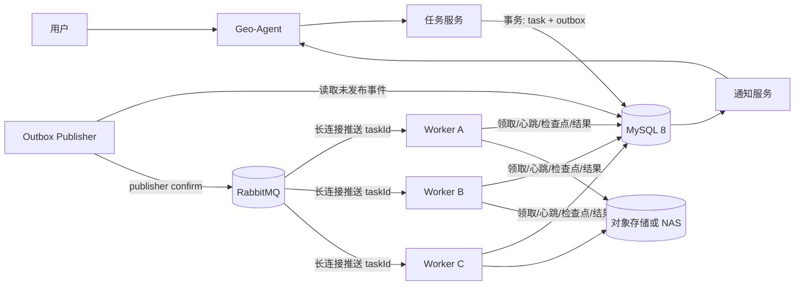

# MySQL + RabbitMQ 多机任务系统设计

> 状态：Proposed（仅设计，尚未实现）
> 当前运行时仍使用 SQLite + 本地 Worker。本设计不改变现有行为。

## 1. 决策摘要

- MySQL 8 作为任务、实验、租约、检查点、重试和 Outbox 的唯一事实源。
- RabbitMQ 使用持久化 Direct Exchange 和长连接消费者，只负责唤醒与分发。
- Worker 收到消息后先在 MySQL 原子领取任务；领取成功后立即 ACK，再执行长时间训练。
- Worker 通过心跳续租；所有状态提交必须携带 fencing token，拒绝过期 Worker 写入。
- 提交任务与创建 Outbox 事件放在同一 MySQL 事务中，避免数据库成功但消息漏发。
- 重试时间由 MySQL `available_at` 管理；中心恢复/调度器低频扫描到期任务并写 Outbox。
- RabbitMQ 的死信队列只保存无法正确投递或格式错误的消息，不替代业务 `dead_letter` 状态。

## 2. 目标与非目标

### 目标

- 多台 CPU Worker 并行执行独立实验。
- Worker 不轮询任务表，空闲时通过 RabbitMQ 长连接等待。
- 主 Agent、Worker 或网络重启后任务不丢失。
- 重复消息不会导致同一任务获得两份有效执行权。
- 支持检查点、有限重试、死信、取消、状态查询和完成通知。
- 保留当前 `queued / running / retrying / succeeded / dead_letter` 语义。

### 当前非目标

- 一个训练任务跨多台机器进行 PyTorch Distributed 训练。
- Kubernetes 调度、自动扩缩容和多租户计费。
- 将大型数据集、日志或模型文件存入 MySQL/RabbitMQ。
- 宣称端到端 exactly-once；目标是 at-least-once 投递 + 业务幂等。

## 3. 总体架构



控制通道是 MySQL + RabbitMQ；数据通道是对象存储或 NAS。RabbitMQ 消息中只放标识与路由信息，不放数据集、模型或完整日志。

## 4. 组件职责

| 组件 | 职责 | 不负责 |
|---|---|---|
| Geo-Agent | 理解意图、生成实验卡、取得确认、查询和解释结果 | 直接执行训练 |
| 任务服务 | 校验请求，在事务中创建实验、任务和 Outbox | 长时间持有训练连接 |
| MySQL | 最终状态、租约、fencing token、重试、检查点、Outbox | 大文件存储 |
| Outbox Publisher | 将已提交的数据库事件可靠发布到 RabbitMQ | 修改任务业务状态 |
| RabbitMQ | 唤醒 Worker、分发任务提示、处理基础投递异常 | 决定任务最终状态 |
| Worker | 原子领取任务、执行预检/训练/汇总、上报心跳和产物 | 自行创造或篡改实验配置 |
| 恢复/调度器 | 恢复过期租约、触发到期重试、写入新 Outbox | 执行训练 |
| 产物存储 | 保存数据、日志、checkpoint、指标和模型 | 任务并发控制 |

## 5. RabbitMQ 拓扑

### 5.1 Exchange 与 Queue

| 名称 | 类型 | 用途 |
|---|---|---|
| `geo.tasks.exchange` | durable direct exchange | 接收可执行任务事件 |
| `geo.tasks.cpu.default` | durable queue | 当前默认 CPU 资源队列 |
| `geo.tasks.dlx` | durable direct exchange | 无法正常投递的消息 |
| `geo.tasks.dead` | durable queue | RabbitMQ 基础设施死信 |

初期只建立一个 CPU 资源队列。后续可增加 `cpu.small / cpu.medium / cpu.large`，Worker 只订阅自身能够执行的队列。

### 5.2 消费配置

- 长连接消费者，不使用 `basic.get` 轮询。
- `prefetch = 1`，一个 Worker 同时只领取一个实验。
- 手动 ACK。
- Exchange、Queue 和消息全部持久化。
- Producer 使用 publisher confirm。
- 消息体必须带 `schemaVersion` 和唯一 `eventId`。

### 5.3 消息信封

```javascript
// 仅为契约草案，不是可运行代码。
// {
//   schemaVersion: 1,
//   eventId: "evt-...",
//   eventType: "task.ready",
//   taskId: "task-...",
//   experimentId: "exp-...",
//   resourceClass: "cpu.default",
//   createdAt: "ISO-8601"
// }
```

消息中禁止出现数据库密码、RabbitMQ 密码、本地绝对路径和完整实验数据。

## 6. MySQL 数据模型

### 6.1 `experiments`

- `id`：实验 ID，主键。
- `name / objective / hypothesis`：实验语义。
- `spec_json`：参数、数据集 ID、代码版本、容器镜像、资源需求。
- `created_at / updated_at`。

### 6.2 `tasks`

- `id`：任务 ID，主键。
- `experiment_id`：唯一索引，第一阶段一个实验只允许一个任务。
- `type`：例如 `seismic_segmentation_train`。
- `state`：字符串状态，避免数据库 ENUM 阻碍后续扩展。
- `priority / resource_class`。
- `attempts / max_attempts / available_at`。
- `lease_owner / lease_token / lease_expires_at / heartbeat_at`。
- `last_error`。
- `created_at / updated_at / started_at / finished_at`。
- `version`：用于乐观并发控制。

关键索引：

```sql
-- 设计说明，不直接执行。
-- UNIQUE(experiment_id)
-- INDEX(state, available_at, priority, created_at)
-- INDEX(lease_expires_at, state)
```

### 6.3 `task_attempts`

- `task_id + attempt_no` 唯一。
- `worker_id / lease_token / state`。
- 开始、结束、错误和产物 URI。
- 每次重试使用独立的 attempt 目录，避免旧 Worker 覆盖新结果。

### 6.4 `task_checkpoints`

- `task_id / attempt_no / step / status`。
- `idempotency_key` 唯一，防止重复写入同一业务检查点。
- `payload_json / created_at`。

### 6.5 `workers`

- `worker_id`：全局唯一，不使用单机 PID 作为身份。
- `hostname / status / heartbeat_at`。
- `capabilities_json`：CPU 核数、内存、操作系统、标签和代码版本。
- `slots_total / slots_used`。

### 6.6 `task_outbox`

- `event_id`：主键。
- `aggregate_id`：通常为 `taskId`。
- `event_type / routing_key / payload_json`。
- `published_at / publish_attempts / next_attempt_at / last_error`。

任务提交和 Outbox 写入必须处于同一个 MySQL 事务。

## 7. 核心流程

### 7.1 提交任务

```javascript
// 1. 用户明确确认实验卡。
// 2. MySQL 事务开始。
// 3. 写入 experiments。
// 4. 写入 state=queued 的 tasks。
// 5. 写入 eventType=task.ready 的 task_outbox。
// 6. 提交事务并立即向用户返回 taskId。
// 7. Outbox Publisher 发布消息并等待 RabbitMQ publisher confirm。
// 8. confirm 成功后标记 outbox.published_at。
```

发布结果不确定时允许再次发布相同 `eventId`；消费者必须按 `taskId` 幂等领取。

### 7.2 Worker 领取与 ACK

```javascript
// 1. Worker 通过长连接收到 task.ready。
// 2. 校验 schemaVersion、taskId 和 resourceClass。
// 3. 在 MySQL 执行条件更新：只有 queued/retrying 且 available_at 到期才能领取。
// 4. 更新成功：state=running、attempts+1、lease_token+1、写入 worker 与租约。
// 5. MySQL 提交成功后立即 ACK RabbitMQ。
// 6. 开始预检和训练；每 10 秒更新 MySQL 心跳和租约。
```

条件更新受影响行数为 0 时，说明消息重复、任务已完成、尚未到期或被其他 Worker 领取；Worker 直接 ACK，不执行训练。

### 7.3 成功完成

```javascript
// 1. 上传日志、checkpoint、summary 和 metrics，取得稳定 URI。
// 2. 使用 taskId + lease_owner + lease_token 条件更新任务。
// 3. 更新成功：state=succeeded，写入 finished_at 和正式产物引用。
// 4. 同一事务写 task.succeeded Outbox 事件。
// 5. 通知服务消费事件并向 CLI/Web 前端推送结果。
```

旧 Worker 使用过期 token 提交时更新行数为 0，其产物只能保留在 attempt 临时目录，不能成为正式结果。

### 7.4 失败、重试与业务死信

```javascript
// 1. Worker 分类永久错误与临时错误。
// 2. 临时错误且 attempts < max_attempts：state=retrying，设置 available_at。
// 3. 永久错误或预算耗尽：state=dead_letter。
// 4. 状态变化和 Outbox 在同一事务提交。
// 5. 调度器发现到期 retrying 任务后创建新的 task.ready Outbox。
```

建议初始退避：5 秒、30 秒、2 分钟；默认最多 3 次。具体值以后放入策略配置。

## 8. 为什么领取后立即 ACK

训练可能持续数小时。若消息一直不 ACK：

- RabbitMQ 消费确认超时需要设置得非常大。
- 网络断开会触发重投，而原 Worker 可能仍在训练。
- Broker Pending 状态与 MySQL 租约形成两套执行权。

因此本设计在 MySQL 成功授予执行权后立即 ACK。RabbitMQ 只保证 Worker 被唤醒；长任务可靠性由 MySQL 租约负责。

## 9. ACK/NACK 决策表

| 场景 | RabbitMQ 操作 | MySQL 操作 |
|---|---|---|
| 格式非法/版本不支持 | reject，不 requeue，进入 Rabbit DLQ | 记录告警 |
| MySQL 暂时不可用 | 不 ACK；暂停消费者并退避重连 | 无 |
| 任务不存在 | ACK | 记录异常事件 |
| 任务已成功/已死信 | ACK | 无 |
| 任务已被其他 Worker 领取 | ACK | 无 |
| 任务尚未到 `available_at` | ACK | 确保到期 Outbox 已存在 |
| 原子领取成功 | ACK | 创建 attempt，进入 running |

禁止无延迟地反复 `nack(requeue=true)`，否则会形成热循环。

## 10. 租约、心跳和 fencing token

- Worker 每 10 秒更新一次心跳。
- 初始租约建议 45 秒，连续三次心跳失败后才允许恢复。
- 每次合法领取使 `lease_token` 单调递增。
- 续租、检查点和最终提交必须匹配 `taskId + lease_owner + lease_token`。
- 中心恢复器低频扫描过期 `running` 任务；它是故障恢复定时器，不是每个 Worker 的任务轮询。
- 过期任务根据重试预算进入 `retrying` 或 `dead_letter`，并通过 Outbox 重新发布。

无法在分布式系统中可靠证明旧 Worker 已经停止，因此 fencing token 是阻止旧 Worker 覆盖新结果的必要条件。

## 11. 幂等策略

1. `tasks.experiment_id` 唯一，避免一次实验重复创建任务。
2. Outbox 使用唯一 `event_id`；重复发布是允许的。
3. Worker 必须先执行 MySQL 条件领取，不能仅凭 RabbitMQ 消息开始训练。
4. `task_attempts(task_id, attempt_no)` 唯一。
5. 检查点使用唯一 `idempotency_key`。
6. 最终提交必须携带 fencing token。
7. 产物按 attempt 隔离，只有当前 token 能登记正式产物。
8. 完成通知使用唯一键 `(task_id, event_type)`，避免重复通知。

这实现的是“消息至少一次、业务效果幂等”，而不是跨 RabbitMQ、MySQL、Python 和文件系统的分布式 exactly-once。

## 12. 多 CPU 资源调度

实验卡增加资源请求：

```javascript
// 仅为字段设计。
// resources: {
//   cpuCores: 8,
//   memoryGb: 16,
//   diskGb: 50,
//   resourceClass: "cpu.default",
//   labels: ["linux", "avx2"]
// }
```

Worker 注册能力并只订阅匹配队列。第一阶段每台 Worker `prefetch=1`、`slots_total=1`；后续再根据 CPU/内存配额允许一台机器执行多个任务，避免 OpenMP、PyTorch 和 DataLoader 线程超卖。

## 13. 配置契约

```powershell
# 仅为配置设计，当前程序不会读取这些变量。
# GEO_QUEUE_BACKEND=mysql-rabbitmq
# GEO_MYSQL_URL=mysql://<user>:<password>@<host>:3306/geo_agent
# GEO_RABBITMQ_URL=amqps://<user>:<password>@<host>:5671/<vhost>
# GEO_WORKER_ID=<globally-unique-id>
# GEO_WORKER_RESOURCE_CLASS=cpu.default
```

真实凭据只通过环境变量或 Secret Manager 注入，不写入仓库、实验卡、日志或 RabbitMQ 消息。

## 14. 故障场景

| 故障 | 预期行为 |
|---|---|
| MySQL 提交成功、MQ 发布失败 | Outbox 保留，Publisher 重试 |
| MQ 已接收、Publisher 未收到 confirm | 可能重复发布；MySQL 原子领取消重 |
| Worker 收到消息后、领取前崩溃 | RabbitMQ 因未 ACK 重新投递 |
| Worker 领取并 ACK 后崩溃 | MySQL 租约过期，恢复器重新排队 |
| Worker 网络隔离但训练仍运行 | 新 Worker 可接管；旧 token 无法提交正式结果 |
| 训练永久配置错误 | 直接进入业务 `dead_letter` |
| RabbitMQ 死信 | 保留原消息与失败原因，人工审计后决定是否重放 |
| 通知重复 | 通知唯一键阻止重复发送 |

## 15. 从当前 SQLite 版本迁移

### 阶段 0：本设计

- 只增加文档，不修改运行代码。

### 阶段 1：存储抽象

```javascript
// 定义 TaskRepository 接口；SQLite 实现保持默认。
// 增加 MySqlTaskRepository，但不开启生产配置。
// 用同一组契约测试验证状态机和租约行为。
```

### 阶段 2：MySQL 单机 Worker

```javascript
// 将任务状态切换到 MySQL。
// Worker 暂时仍在本机启动，用于隔离数据库迁移风险。
```

### 阶段 3：RabbitMQ + Outbox

```javascript
// 提交任务改为 task + outbox 事务。
// Worker 改为 RabbitMQ 长连接消费者，不再轮询任务表。
// 保留恢复器对过期租约和到期 retrying 的低频扫描。
```

### 阶段 4：远程多机 Worker

```javascript
// Worker 变成常驻服务并注册 machine capabilities。
// 数据与产物路径改为共享 URI。
// 验证重复投递、断网、崩溃和旧 Worker 晚提交场景。
```

### 阶段 5：切换与回滚

- 配置开关选择 `sqlite` 或 `mysql-rabbitmq`。
- 观察一个发布周期后再移除 SQLite 写路径。
- 旧 `.geo-agent/queue.sqlite` 只读归档，不自动删除。

## 16. 验收标准

- 三台 Worker 空闲时数据库无任务领取轮询。
- 连续提交多个任务能够由不同 Worker 消费，单任务只有一个有效 lease token。
- 重复发布同一 `taskId` 不会产生第二次合法运行。
- Worker 在领取前、领取后、训练中和提交结果前崩溃均可恢复。
- 旧 Worker 晚提交不能覆盖新 Worker 的结果。
- 临时错误按策略重试，永久错误和预算耗尽进入业务死信。
- MySQL 成功但 RabbitMQ 暂时不可用时，Outbox 最终能够补发。
- CLI/Web 能收到一次且仅一次的业务完成通知。
- 所有任务、attempt、检查点、错误和正式产物 URI 可审计。

## 17. 后续实现前需确认

- MySQL 与 RabbitMQ 是本地 Docker、局域网服务还是云托管。
- 远程 Worker 的操作系统与容器运行方式。
- 数据集和产物使用 MinIO、S3 还是共享 NAS。
- 第一阶段 CPU 资源分类及每台机器允许的并行任务数。
- 是否需要迁移现有 SQLite 历史任务，还是只归档。
