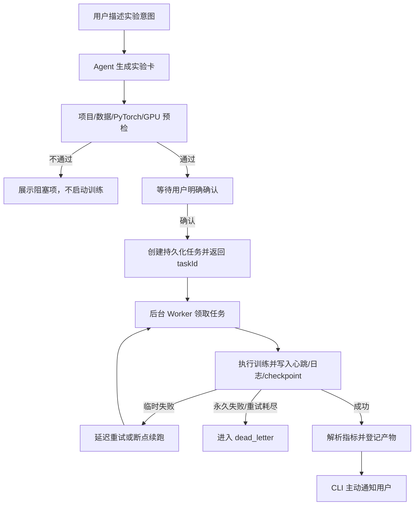
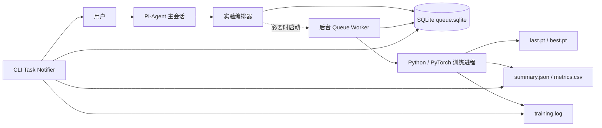
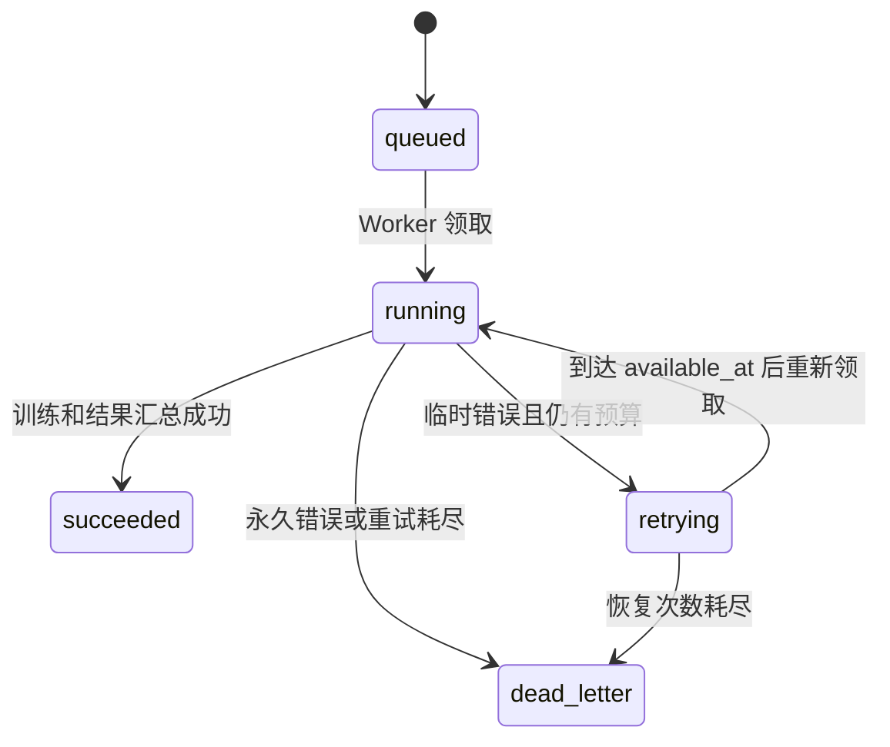

# Geo-Agent 异步实验任务系统说明

> 本文从业务目标出发，说明 Geo-Agent 当前异步实验任务功能的总体流程、核心机制、技术选型、可靠性边界，以及向多机架构演进的方向。

## 1. 为什么需要异步任务系统

地震相分割实验与普通聊天请求有明显差异：一次模型回答通常只需数秒，而深度学习训练可能持续数分钟、数小时甚至更久。

如果让主 Agent 在一次对话中同步等待训练完成，会产生以下问题：

- 训练期间 Agent 被占用，用户无法继续准备或讨论其他实验。
- CLI、HTTP 请求或模型会话中断后，用户无法确认实验是否仍在运行。
- 程序重启后，内存中的任务状态会丢失。
- 多个实验同时提交时，可能争抢同一计算资源。
- 失败后只能查看日志并手工重跑，无法自动重试或恢复进度。
- 用户必须持续盯着终端，才能知道实验何时结束。

异步任务系统将“理解实验意图”和“执行长时间训练”拆开：

```text
主 Agent 负责理解、规划和提交
后台 Worker 负责执行、恢复和汇报
持久化队列负责连接两者
```

任务提交成功的业务含义不再是“训练已经结束”，而是：

> 实验已经被系统可靠接管，并获得了可查询、可恢复的任务编号。

## 2. 用户视角的总体流程



用户体验如下：

```text
1. 用户：准备 baseline、单卡 GPU、3 epoch 实验
2. Agent：生成实验卡并完成预检，但不启动训练
3. 用户：确认提交
4. Agent：返回 taskId，用户可以继续对话
5. Worker：后台执行训练
6. CLI：显示 Epoch 进度
7. CLI：训练完成后主动显示 MIoU 和结果目录
```

## 3. 当前系统架构



当前主要组件包括：

| 组件 | 业务职责 | 技术实现 |
|---|---|---|
| 主 Agent | 理解实验意图、生成实验卡、获得确认、解释结果 | Pi-Agent 会话与领域工具 |
| 实验编排器 | 创建实验、执行预检、入队、查询和汇总 | Node.js 模块 |
| 持久化任务队列 | 保存任务状态、租约、重试次数和检查点 | Node.js 22 内置 SQLite |
| Queue Worker | 串行领取任务、启动训练、记录状态 | 独立 Node.js 后台进程 |
| 训练进程 | 执行地震相分割训练和评估 | Python + PyTorch |
| Task Notifier | 自动观察进度并向用户通知 | CLI 定时读取任务状态 |
| 运行目录 | 保存实验卡、日志、checkpoint 和指标 | 本地文件系统 |

## 4. 实验卡与人工确认

Agent 首先将自然语言转换为可审计实验卡，主要包含：

- 实验名称、目标和假设。
- 数据模式与数据路径。
- 模型变体、epoch、batch size 等训练参数。
- 设备与资源配置。
- 成功标准。
- 实际训练命令预览。
- 项目、数据、Python、PyTorch、CUDA 和 GPU 预检结果。

`prepare_experiment` 只准备实验，绝不会启动训练。只有用户明确确认后，Agent 才能调用 `submit_experiment`。

这一设计解决两个业务问题：

1. 防止 Agent 因误解意图而直接消耗 GPU 资源。
2. 让每次实验在执行前都有可追溯的目标、参数和验收条件。

## 5. 任务提交与身份标识

提交后系统会生成两个标识：

- `experimentId`：表示科研实验及其配置、目标和产物。
- `taskId`：表示该实验的一次后台执行任务。

当前第一阶段一个实验只允许创建一个训练任务。任务写入 SQLite 后立即返回：

```text
taskId
experimentId
state = queued
maxAttempts
```

主 Agent 不等待训练完成，因此用户可以继续对话或准备其他实验。

## 6. 任务状态机



各状态的业务含义：

| 状态 | 含义 |
|---|---|
| `queued` | 系统已接收任务，等待 Worker 和计算资源 |
| `running` | Worker 已获得执行权并正在处理 |
| `retrying` | 发生可恢复错误，等待下一次尝试 |
| `succeeded` | 训练、评估和结果汇总全部完成 |
| `dead_letter` | 无法自动恢复，需要人工处理 |

## 7. Worker 如何执行任务

Worker 是独立后台进程，不是另一个聊天 Agent。它不断执行以下流程：

```text
领取任务
  ↓
重新执行环境预检
  ↓
记录 training/started 检查点
  ↓
启动 Python/PyTorch 子进程
  ↓
定期更新任务心跳和租约
  ↓
解析 summary.json
  ↓
成功、重试或死信
```

当前是单机单 GPU 模式，因此只允许一个 Queue Worker 获得 `gpu-0` Worker 租约，避免多个任务同时抢占显卡。

训练进程的标准输出和错误输出都写入 `training.log`，不会阻塞主 Agent 会话。

## 8. 租约与心跳

仅将任务标记为 `running` 不足以判断 Worker 是否仍然存活，因此系统还记录：

- `lease_owner`：当前执行者。
- `lease_expires_at`：执行权到期时间。
- `heartbeat_at`：最近一次心跳。

Worker 定期续租。如果 Worker 异常退出，心跳停止，租约到期后：

- 尚有重试预算：任务恢复为 `retrying`。
- 重试预算耗尽：任务进入 `dead_letter`。

租约解决的是“Worker 崩溃后任务不能永远卡在 running”的问题。

## 9. 流程检查点

SQLite 中会保存步骤级检查点：

```text
task/queued
preflight/started
preflight/completed
training/started
training/completed
summary/started
summary/completed
task/succeeded、retrying 或 dead_letter
```

这些检查点用于：

- 展示任务执行到哪一步。
- 区分预检、训练和指标汇总错误。
- 记录每次 attempt 的执行历史。
- 为后续更细粒度的步骤恢复提供基础。

流程检查点不包含模型权重；模型恢复由 PyTorch checkpoint 完成。

## 10. PyTorch 断点续跑

每完成一个 epoch，目标训练脚本保存：

```text
outputs/<variant>/last.pt
```

其中包含：

- 模型参数。
- 优化器状态。
- 学习率调度器状态。
- AMP GradScaler 状态。
- 已完成 epoch。
- 当前最佳验证 MIoU。
- 历史训练指标。

任务重新领取后，Worker 仅在以下条件同时满足时传入 `--resume`：

```text
attempts > 1
last.pt 存在
```

训练脚本读取 checkpoint，并从 `checkpoint_epoch + 1` 开始继续。因此进程在某个 epoch 中途退出时，最多损失当前未完成的 epoch。

## 11. 重试与死信

Worker 会区分错误类型：

- 临时错误：连接中断、超时、临时不可用、Worker 异常等。
- 永久错误：CUDA OOM、模块缺失、文件缺失、shape mismatch、预检失败等。

临时错误按照退避时间重新执行；当前默认最大尝试次数为 3。永久错误或重试预算耗尽后进入 `dead_letter`。

死信的业务意义是：

> 系统已经停止自动尝试，需要用户检查配置、数据、代码或资源。

## 12. 自动进度和完成通知

异步执行解决了“训练不能阻塞对话”，但还需要解决“用户不知道何时完成”。

CLI 通过 Pi-Agent 的 `tool_execution_end` 事件捕获 `submit_experiment` 返回的结构化 `taskId`，然后启动任务观察器。

观察器当前每两秒读取一次任务状态：

- epoch 变化时显示训练进度。
- 状态进入 `retrying` 时显示重试信息。
- 状态进入 `succeeded` 时读取真实 `summary.json`，显示 MIoU 和结果目录。
- 状态进入 `dead_letter` 时显示错误原因和日志路径。

通知依赖结构化工具结果，而不是解析模型自由文本，从而避免模型省略或改变 `taskId` 表述。

如果 CLI 关闭，后台训练不会停止，但关闭期间无法显示即时终端通知；用户稍后仍可通过 `taskId` 查询持久化结果。

## 13. 数据与产物

每个实验拥有独立运行目录：

```text
.geo-agent/runs/<experiment_id>/
├── experiment.json
├── status.json
├── training.log
└── outputs/
    ├── configuration.json
    ├── metrics.csv
    ├── summary.json
    └── <variant>/
        ├── history.csv
        ├── best.pt
        └── last.pt
```

各文件职责：

| 文件 | 用途 |
|---|---|
| `experiment.json` | 实验目标、参数、路径、预检和命令 |
| `status.json` | 兼容的当前状态快照 |
| `training.log` | epoch 进度和 Python 错误 |
| `summary.json` | 最终核心指标 |
| `metrics.csv` | 详细测试指标 |
| `history.csv` | 每个 epoch 的训练历史 |
| `last.pt` | 断点续跑 checkpoint |
| `best.pt` | 最佳验证指标模型 |

## 14. 当前技术选型及原因

### SQLite

当前阶段是单机、单用户、单 GPU，SQLite 能以一个本地文件提供事务、持久化和状态查询，不需要部署数据库服务，适合快速验证任务生命周期。

它不是专业 MQ；当前系统是在数据库表上实现轻量任务队列。

### 独立 Node.js Worker

将长任务从 Agent 会话中分离，避免训练阻塞对话，并使 CLI 退出后训练仍可继续。Node.js 负责编排，Python/PyTorch 继续负责训练，避免重写科研代码。

### 文件系统产物

单机阶段直接保存日志、模型和指标最简单，也便于科研人员手工检查。大型二进制产物不会写入 SQLite。

### 定时状态观察

CLI 没有浏览器或 HTTP 长连接，因此使用两秒一次的本地状态读取实现通知。对于分钟级训练，该开销很小；未来 Web 前端会演进到 SSE/WebSocket。

## 15. 当前可靠性保证

当前系统能够保证：

- 任务入队后状态持久化，Agent 重启不会丢失任务记录。
- 单机环境下，同一时间只有一个 Queue Worker 使用目标 GPU。
- Worker 崩溃后，过期任务可以恢复或进入死信。
- 失败任务不会无限重试。
- 存在合法 `last.pt` 时可以从上一个完整 epoch 恢复。
- 指标来自真实训练产物，而不是模型推断或编造。
- 用户可以使用 `taskId` 查询状态、检查点、日志和产物。

## 16. 当前边界与风险

- SQLite 和本地路径不适合多机共享。
- checkpoint 只在 epoch 结束保存，不支持 batch 级恢复。
- `last.pt` 尚未采用临时文件加原子重命名，写入中断可能导致文件损坏。
- 尚未保存 Python、NumPy 和 PyTorch RNG 状态，恢复后不保证逐位一致。
- 没有 checkpoint 版本和实验参数兼容性校验。
- CLI 关闭期间没有系统级通知。
- 当前 Worker 调度只理解单机 `gpu-0`，尚不能根据 CPU、内存和机器标签分配任务。
- 当前实验卡完整落盘，但终端展示仍可能被模型概括。

## 17. 向多机架构演进

目标架构已设计为 MySQL + RabbitMQ：

- MySQL 保存任务、租约、fencing token、检查点、重试和 Outbox，是唯一事实源。
- RabbitMQ 使用长连接消费者唤醒和分发 Worker，Worker 不再轮询任务表。
- Worker 在 MySQL 原子领取成功后立即 ACK RabbitMQ。
- 长时间训练继续由数据库租约和心跳管理。
- 重复消息通过唯一约束、条件更新和 fencing token 实现业务幂等。
- 模型、日志和数据迁移到 MinIO、S3 或共享 NAS，远程 Worker 才能断点续跑。

详细设计见 [MySQL + RabbitMQ 多机任务系统设计](architecture/mysql-rabbitmq-task-queue.md)。当前仅完成设计，尚未切换运行代码。

## 18. 一句话总结

> Geo-Agent 的异步任务系统把一次长时间深度学习实验变成了可确认、可排队、可查询、可重试、可恢复、可审计并能主动通知的业务任务；当前以 SQLite + 本地 Worker 验证闭环，未来再演进到 MySQL + RabbitMQ 的多机架构。
